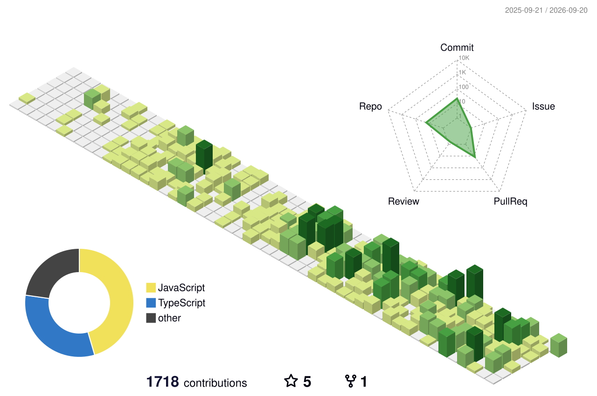

# 你好，我是 Zipper 👋

**AI Agent 方向 · 全栈工程师**&nbsp;·&nbsp;中国传媒大学&nbsp;·&nbsp;北京

> Striving for impact. Still learning, still growing.

正在打造 **[Yila AI](https://yila.ai)** —— 一款"学术版 Manus"： 
面向科研场景的 Agent SaaS，具备持久化会话、人机协同确认门与积分计费。

---

## 🐍 看小蛇吃掉我的提交格子

<picture>
  <source media="(prefers-color-scheme: dark)" srcset="https://raw.githubusercontent.com/zhanpeng329-arch/zhanpeng329-arch/output/github-snake-dark.svg" />
  <source media="(prefers-color-scheme: light)" srcset="https://raw.githubusercontent.com/zhanpeng329-arch/zhanpeng329-arch/output/github-snake.svg" />
  
</picture>

## 📦 立体贡献图

<picture>
  <source media="(prefers-color-scheme: dark)" srcset="./profile-3d-contrib/profile-night-view.svg" />
  <source media="(prefers-color-scheme: light)" srcset="./profile-3d-contrib/profile-green-animate.svg" />
  
</picture>

---

## 🧑‍💻 关于我

- 🤖 主要做 **大模型 Agent 系统**：持久化多轮会话、工具调用契约、人机协同（HITL）确认门、沙箱代码执行，以及 Token / 积分计量结算。
- 🧱 我同样在意"上线之后"的那一半工作——数据库迁移、发布围栏、零残留发布流程，以及**可复现、可复算的验证证据**，而不只是一个能跑的 Demo。
- 🎓 就读于 **中国传媒大学**，常驻北京。
- 🛠️ 当前主力技术栈：**TypeScript / Next.js / PostgreSQL / Node.js / Python**。
- 📫 联系方式：**contact@figpad.ai**

<b>English version (click to expand)</b>

 

I'm an **AI-agent-focused full-stack engineer**, studying at Communication University of China, based in Beijing.

I'm currently building **Yila AI**, an "academic Manus" — a research-agent SaaS covering durable
agent sessions, human-in-the-loop approval gates, sandboxed code execution, tool contracts and
credit-based metering. I care as much about the unglamorous half of shipping — migrations,
release fences, zero-drain deploys and re-runnable evidence — as I do about the demo.

Mainly working with **TypeScript / Next.js / PostgreSQL / Node.js / Python**.
Feel free to reach me at **contact@figpad.ai**.

---

## 🧰 技术栈

---

## 🚀 正在做的项目

<table>
<tr>
<td width="50%" valign="top">

### 🧪 Yila AI · 学术研究 Agent
已上线、服务真实用户的科研 Agent SaaS（"学术版 Manus"）。

- 基于 **Vercel Eve** 运行时的持久化会话，支持断线续跑与回放
- 面向高成本 / 不可逆操作的 **人机协同确认门（HITL）**
- 分层 **用户记忆**、学术检索工具链、产物与学术海报生成
- **积分预扣 → 用量计量 → 结算** 的完整可审计计费闭环
- Docker / Dokploy 自托管，配合 PostgreSQL + Cloudflare R2

<a href="https://yila.ai">🔗 yila.ai</a> · 源码私有

</td>
<td width="50%" valign="top">

### 🧩 obsidian-CodeIndentation
一款 Obsidian 插件，修复编辑器内代码块的缩进行为。

- 使用 **TypeScript** 基于 Obsidian 插件 API 开发
- ⭐ 已有社区用户在使用

<a href="https://github.com/zhanpeng329-arch/obsidian-CodeIndentation">🔗 仓库</a>

### 🎨 figpad
偏设计方向的个人项目，探索更轻量的创作画布。

<a href="https://github.com/zhanpeng329-arch/figpad">🔗 仓库</a>

</td>
</tr>
</table>

---

## 📈 GitHub 数据

  

---

感谢来访 —— 欢迎提 issue 或直接来信交流 🙌

